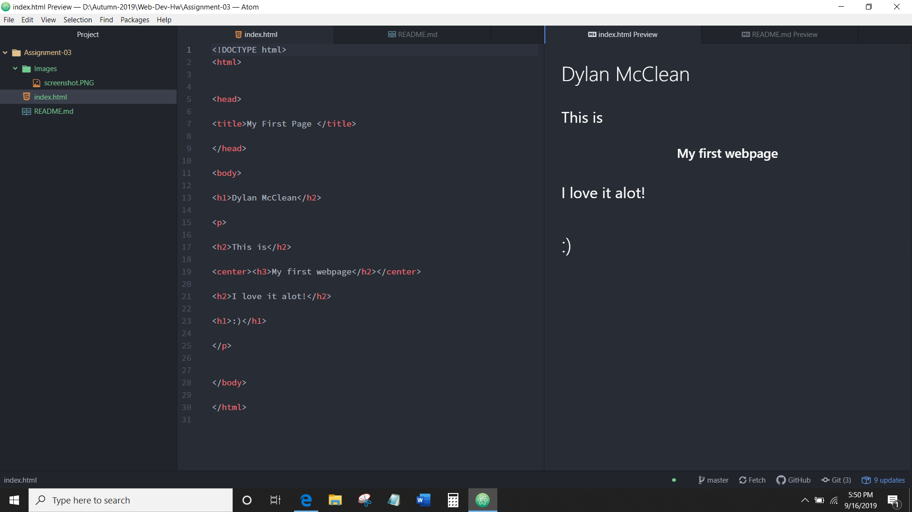

#  
 Dylan McClean 

#### 
 Assignment-03 

 

1.   The way internet browsers work are quite simple. They use render engines to be able to decode the language for a webpages display. Using different individual engines to decode the differnet languages such as translating html and css files. In order for browsers to display the design and text elements of a webpage correctly.

2. A markup of language is the special way in which a computer reads characters and symbols to display text and other various design features. The most commonly one used is html. Standing for Hypertext markup language this is the basis for all webpages and web development to take place. It's the most basic and easy to understand for amatuer coders and web developers.

