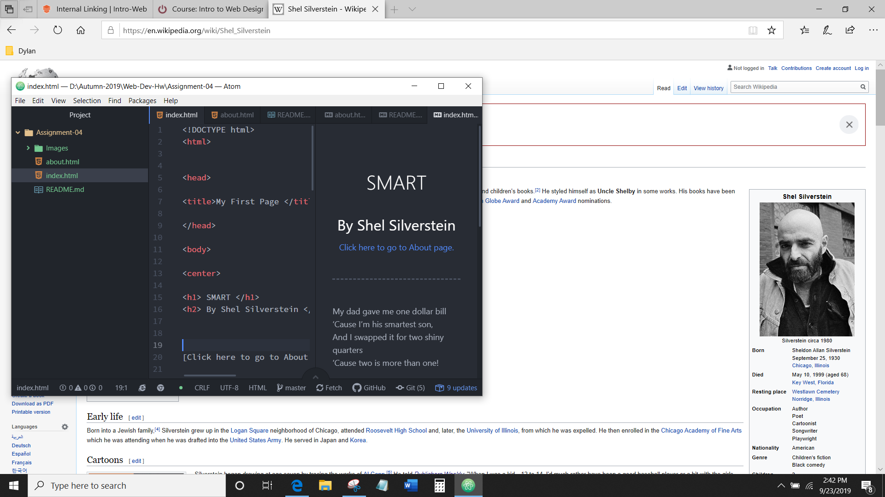

#  Dylan McClean

####  Assignment-04

 

1. I visited the most used search engine on the way back machine. I skimmed the various screenshots of google through a time period of about 10 years. The differences of the webpage were mainly the functions and features that have been added over time. Such as the top right login along with the many services goole offers such as translate, youtube, maps and google play. And the same goes for the layour features such as searching for the web, images, and directory. The google doodle is something that has changed significantly on the google homepage.

2. Using the git module is somthing that I highly prefer. Not only does it track and show you changes but its is simple to upload to any repository. When I first started using Github desktop it took me a while to be able to figure out how to link directories to a new repository created. Such as everything I would upload for web design went into my creative coding repository. I highly recommend anyone to use Github desktop specifically for it's convenience.

 

