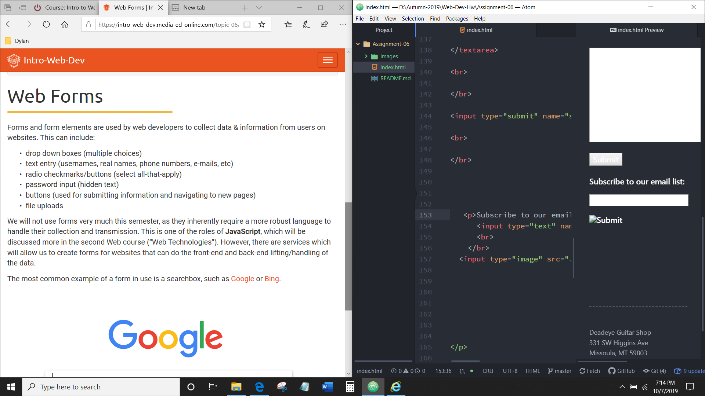

# Dylan McClean

## Assignment 06

 

 

1. Most forms I come across on the web are mainly logins. Along with the occasional subscribe or email submit buttons. Which these serve the purpose for being able to retrieve data for login information. Mainly to login to a website under a username or to attach that username's email address to a subscription service.

2. The best example's for these types inputs are on survey's. When I visit alot of gaming websites I take survey's to improve the quality of the experience. Along with youtube which has some input button's on their videos when a survey pops up instead of an advertisement.

3. My work cycle for this assignment is as follows. Learn about forms and how their attributes and methods are the main component of how they function. Familiarize myself with the tags for these form elements. Work on a nice layout for a mockup webpage that would utilize these forms.

 

