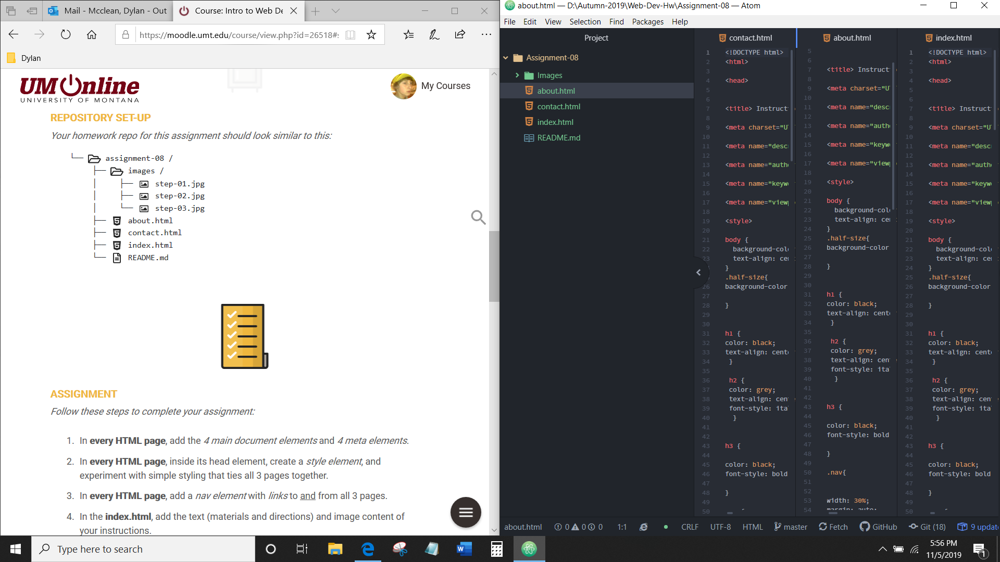

# Dylan McClean

## Assignment-08

<ol>

<li>
The only difficulty I had for this assignment was mainly the use of the stylesheets. specifically creating my own classes with certain names and orgainizing them efficiently. For example I found myself creating new ones for certain semantic markup such as italics. I created a whole one for this and then I figured out where to put in the element tags in order to have the style I wanted. Such as the italics in the placeholder text for the comments section in the contact page.

</li>

 

<li>

I am actually excited to pretty much expand the knowledge of certain stylized elements. And I'm also looking forward to dive more into organizing the whole layout of a page such as having various content aligned on the left, center, and right of a page. As all of my content is typically found within the center.

</li>

<li>

My work cycle was as follows. I set up the basic elements for the html setup for each file. I played around with background and text color. I changed up certain style elements within the stylesheet to my liking. I played around with links testing them out to make sure they work and that each page was styled to match the others as well. Then I setup the text for instructions implementing various semantic markup techniques. Then I inserted a video and a link to a website. Finally I used forms to finish off the contact page to complete the instructional website.

</li>

</ol>

 

